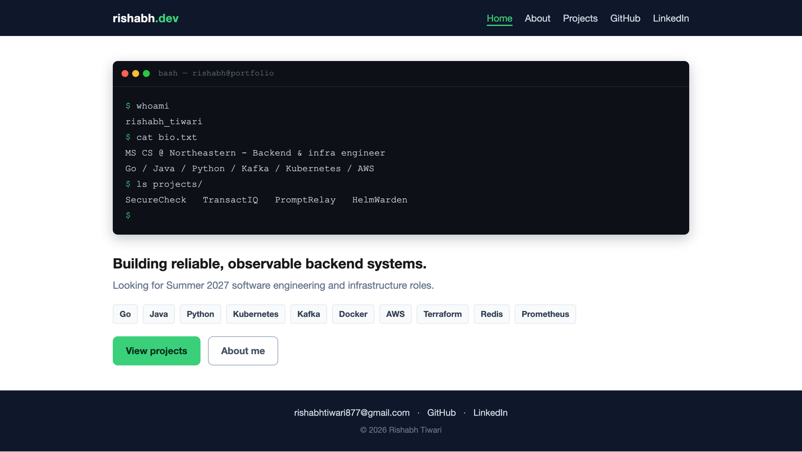

# Rishabh Tiwari - Personal Homepage

**Author:** Rishabh Tiwari
**Class:** CS 5610 Web Development, Northeastern University (Fall 2026) - [course link](https://johnguerra.co/classes/webDevelopment_fall_2026/)

## Project Objective

A front-end-only personal homepage that presents me as a backend and infrastructure
software engineer. It is built with vanilla HTML5, CSS3, and ES6 modules, uses a flexbox
and CSS grid layout, and is deployed as a static site on GitHub Pages. The goal is a fast,
accessible, professional page that a recruiter or engineer can scan in under a minute.

The site has three pages, each at its own URL:

- **Home** (`index.html`) - an animated terminal that types out an intro as a shell session (the original component), plus a short bio, tech stack, and links.
- **About** (`about.html`) - background, experience, featured projects, and a contact form with client-side validation.
- **Projects** (`projects.html`) - a gallery of projects with generated architecture diagrams, technology filters, sorting, and a detail dialog. This is the AI-generated page.

## Screenshot



## Live Site

<https://rishabht877.github.io/homepage/>

## Features

- **Animated terminal (original component).** `js/terminal.js` types out a shell
  session character by character on the home page, ending on a blinking cursor.
- **Generated architecture diagrams.** `js/diagram.js` builds an animated SVG
  schematic for each project from its pipeline data: labelled nodes, directional
  connectors, and a pulse that travels the path. Every element is created with the
  DOM API, so there is no charting or icon library involved.
- **Filterable gallery.** Multi-select technology filters with per-tag counts,
  three sort orders, a live result count, and an empty state.
- **Shareable URLs.** The active filters and sort are written to the query string
  (for example `?tags=Go,Docker&sort=name`) and restored on load.
- **Project detail dialog.** A native `<dialog>` with the full-size diagram, key
  metrics, engineering highlights, and the stack.
- **Client-side contact form.** `js/contact.js` validates the fields and then opens
  the visitor's mail client through a `mailto:` link.
- **Accessible by default.** Real `<button>`/`<select>`/`<dialog>` elements, labels
  on every control, `aria-pressed` on the filters, alt text on images, and full
  `prefers-reduced-motion` support.

## Built With

- HTML5 - semantic elements, native `<dialog>`, `<button>`, `<select>`
- CSS3 - flexbox and CSS grid, custom properties, no frameworks, no `!important`
- JavaScript - ES6 modules only; no jQuery, no component or charting libraries
- Inline SVG, generated at runtime, for the architecture diagrams

## Project Structure

```
homepage/
  index.html          Home page (animated terminal)
  about.html          About, experience, featured projects, contact form
  projects.html       Projects gallery (the AI-generated page)
  css/
    styles.css        All styles: layout, components, diagram theming
  js/
    main.js           Shared nav toggle and footer year
    terminal.js       Typewriter for the home page terminal
    data.js           Project data, including each diagram's pipeline
    diagram.js        Generates the animated SVG architecture diagrams
    projects.js       Gallery rendering, filtering, sorting, URL state, dialog
    contact.js        Contact form validation
  images/
    favicon.svg
  package.json
  .prettierrc
  LICENSE
  README.md
  design-doc.pdf
```

## Instructions to Build and Run

This is a static site, but because it uses ES6 modules it must be served over HTTP
(opening the HTML files directly with `file://` will block the module imports).

1. Clone the repository:
   ```
   git clone https://github.com/rishabht877/homepage.git
   cd homepage
   ```
2. Start any static server. For example, with Python:
   ```
   python3 -m http.server 8080
   ```
   or with Node:
   ```
   npx http-server -p 8080
   ```
3. Open `http://localhost:8080` in your browser.

### Formatting and linting

```
npm install
npm run format
npm run lint
```

`eslint.config.js` in the project root is an ESLint 9 flat config set up for
browser ES6 modules. Both commands exit clean: Prettier reports no formatting
issues and ESLint reports no errors or warnings.

## Use of Generative AI

Generative AI was used to build parts of this project. Details below, as required
by the assignment.

### Tools and models

| Tool        | Model         | Version / ID    | How it was accessed                                       |
| ----------- | ------------- | --------------- | --------------------------------------------------------- |
| Claude Code | Claude Opus 5 | `claude-opus-5` | Anthropic's agentic CLI, run inside the VS Code extension |

Session date: 27 September 2026.

### How it was used

I directed the model conversationally and reviewed every change. The work was
iterative rather than one-shot: I gave a goal, looked at the result in the browser,
and asked for changes. Specifically, the model was used to:

1. **Add a fourth project (SecureCheck).** I supplied the project description,
   architecture, and repository link; the model structured that into the project
   data file and wrote the corresponding markup.
2. **Rebuild the projects gallery** (`projects.html` — this is the AI-generated
   page). The model wrote `js/diagram.js`, which generates an animated SVG
   architecture diagram per project, and rewrote `js/projects.js` to add tag
   filtering, sorting, shareable URL state, and a native `<dialog>` detail view.
3. **Remove a feature I decided against.** It had added a live search box; I judged
   it unnecessary for four projects and had it stripped out completely.
4. **Test the result.** It drove headless Chrome over the DevTools Protocol to
   verify filtering, sorting, deep links, and the dialog actually worked, and
   re-ran the W3C validator after every markup change.

### Prompts used

These are my actual instructions from the session, lightly trimmed:

1. _"Add visuals, add interactions, add whatever you think looks crazy."_ — I left
   this deliberately open at first because I wanted to see what the model would do
   on its own before giving it tighter direction.
2. _"My new project is SecureCheck — a CI/CD security gate that automatically scans
   every GitHub pull request for vulnerabilities and blocks merges on HIGH severity
   findings..."_ (followed by the full architecture description and repo link)
3. _"Remove the live search feature from the projects section entirely. I only have
   4 projects, so search adds no value and just clutters the UI."_

### What was and was not AI-generated

**AI-generated:** the `projects.html` gallery page and its supporting modules
(`js/diagram.js`, `js/projects.js`), the SVG architecture diagram rendering, and
the gallery CSS.

**Mine:** all project content and technical descriptions, the decision to feature a
terminal typewriter as the site's original component, the visual direction, and
every product decision about what to keep or cut — including removing the search
feature the model added.

All generated code was reviewed, run locally, and validated before being committed.

## License

MIT - see [LICENSE](./LICENSE).
